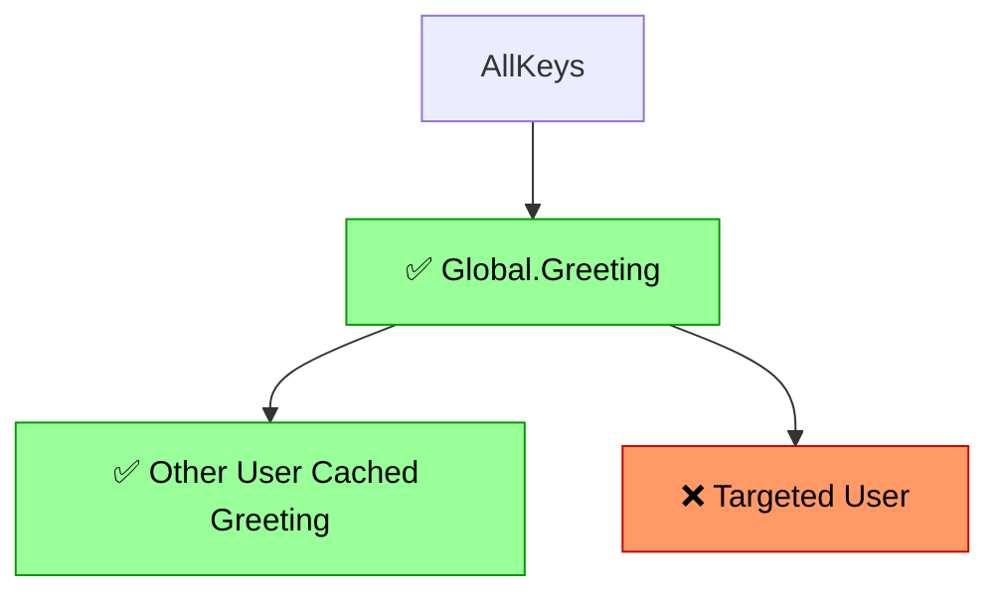
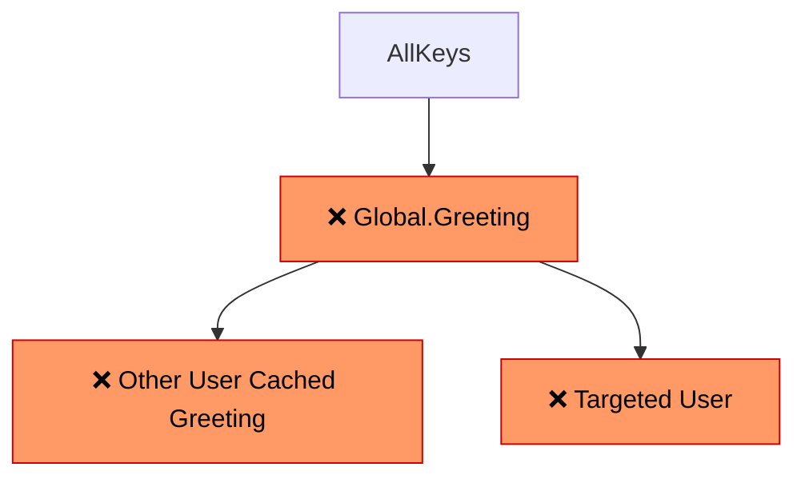

# fragmented-keys

Fragmented Key Management and Invalidation Library for use with Redis.

A Python port of [noizu-labs/fragmented-keys](https://github.com/noizu-labs/fragmented-keys) (PHP), adapted to use Redis as the cache backend.

## Overview

Fragmented Keys provide a straightforward way to manage and invalidate composite cache keys.

The library persists tag-instance versioning information in Redis (or another backend of your choice). When constructing composite/fragmented keys, these tags and their current versions are combined to generate the final cache key.

```
Cache Key = md5( base_key + tag1:version1 + tag2:version2 + ... )
```

Instead of deleting cached entries individually, you increment a tag's version — all keys that depend on that tag automatically resolve to a new cache key, leaving the old entries to expire naturally.

### How Invalidation Works

Say you have cached data tied to both a global greeting template and a per-user username. You can selectively invalidate only items linked to a specific user:

```python
user_tag = StandardTag("User.Username", user_id)
user_tag.increment()
```

Behind the scenes, only the targeted user's cached data is invalidated — everything else remains valid:



Or you could invalidate *all* keys that depend on `Global.Greeting` — but make sure your database is ready for the traffic spike:

```python
greeting_tag = StandardTag("Global.Greeting", "global")
greeting_tag.increment()
```



This tree-structured invalidation is the core power of fragmented keys: fine-grained control over which cached data expires, without needing to track individual cache entries.

## Installation

```bash
uv add fragmented-keys
```

Or with pip:

```bash
pip install fragmented-keys
```

## Quick Start

```python
from redis import Redis
from fragmented_keys import Configuration, RedisHandler, StandardTag, StandardKey

# Setup
client = Redis(host="127.0.0.1", port=6379)
Configuration.set_default_cache_handler(RedisHandler(client))
Configuration.set_global_prefix("MyApp")

# Create tags
user_tag = StandardTag("User", "42")
city_tag = StandardTag("City", "chicago")

# Build a composite key
key = StandardKey("UserDashboard", [user_tag, city_tag])
cache_key = key.get_key_str()  # MD5 hex digest

# Use it with Redis
data = client.get(cache_key)
if data is None:
    data = fetch_from_database()
    client.set(cache_key, data)

# Invalidate all keys depending on User:42
user_tag = StandardTag("User", "42")
user_tag.increment()
# Next call to get_key_str() with User:42 will produce a different key
```

## Tag Types

Tags represent a logical grouping that you would, under certain circumstances, want to invalidate associated cached data for. A `User:{id}` pair, a `Site:{siteId}`, etc. The library appends `@version` fields to tag-instance pairs so that when you want to invalidate a large swath of related items, you don't need to send dozens of delete requests to your cache — you make a single `tag.increment()` call and any keys using that tag-instance produce new cache keys automatically.

### StandardTag

Version is stored in the cache backend and can be incremented. Each increment changes the version by `+0.1`, invalidating all dependent keys.

```python
tag = StandardTag("User", "42")
tag.get_tag_version()   # Fetches or seeds version from cache
tag.increment()         # Version += 0.1, persisted to cache
tag.reset_tag_version() # Resets to a new time-based value
```

### ConstantTag

Version is fixed at construction time. Mutations are no-ops. Useful for incorporating non-versioned tag-instance details into large composite keys (e.g., an API version or schema version that rarely changes).

```python
tag = ConstantTag("ApiVersion", "v2", version=2.0)
tag.increment()         # No-op
tag.get_tag_version()   # Always 2.0
```

## Cache Handlers

### RedisHandler

Primary backend using `redis-py`. Supports `mget` for bulk version fetches and `setex` for TTL.

```python
from redis import Redis
from fragmented_keys import RedisHandler

handler = RedisHandler(Redis(host="127.0.0.1", port=6379))
```

### MemoryHandler

In-memory dict-based handler for testing.

```python
from fragmented_keys import MemoryHandler

handler = MemoryHandler()
```

### Custom Handlers

Implement the `CacheHandler` protocol:

```python
from fragmented_keys.protocols import CacheHandler

class MyHandler:
    def group_name(self) -> str:
        return "MyHandler"

    def get(self, key: str) -> str | None: ...
    def set(self, key: str, value: str, ttl: int | None = None) -> None: ...
    def get_multi(self, keys: list[str]) -> dict[str, str]: ...
```

## KeyRing

`FragmentedKeyRing` is a factory for defining reusable key templates and producing configured `StandardKey` instances.

```python
from redis import Redis
from fragmented_keys import FragmentedKeyRing, RedisHandler

redis_handler = RedisHandler(Redis())
memory_handler = MemoryHandler()

ring = FragmentedKeyRing(
    global_options={"type": "standard"},
    global_tag_options={
        "universe": {"type": "constant", "version": 1.0},
    },
    default_cache_handler="redis",
    cache_handlers={
        "redis": redis_handler,
        "memory": memory_handler,
    },
    default_prefix="MyApp",
)

# Define key templates
ring.define_key("Users", [
    "universe",
    {"tag": "planet", "cache_handler": "memory"},
    "city",
])

# Get a configured key object
key_obj = ring.get_key_obj("Users", ["MilkyWay", "Earth", "Chicago"])
cache_key = key_obj.get_key_str()

# Or use dynamic accessor
key_obj = ring.get_users_key_obj("MilkyWay", "Earth", "Chicago")
```

### Tag Options

Options are merged in order: global options → per-tag options → per-key overrides.

| Option | Type | Description |
|--------|------|-------------|
| `type` | `"standard"` \| `"constant"` | Tag type (default: `"standard"`) |
| `version` | `float` | Initial version value |
| `cache_handler` | `str` | Handler key from `cache_handlers` dict |
| `prefix` | `str` | Override global prefix for this tag |

## Configuration

Global defaults shared across all tags and keys:

```python
from fragmented_keys import Configuration

Configuration.set_default_cache_handler(handler)  # Fallback handler
Configuration.set_global_prefix("MyApp")           # Key namespace prefix
```

## How It Works

1. Each `StandardTag` stores its current version in the cache backend under the key `{tag}_{instance}{prefix}`.
2. When building a composite key, `StandardKey` bulk-fetches all tag versions using `get_multi` (grouped by handler) for efficiency. `ConstantTag` instances are skipped in bulk fetches since their version is fixed.
3. The final key is `md5("{keyName}_{groupId}:t{tag1Name}:v{version1}:t{tag2Name}:v{version2}...")`.
4. Calling `tag.increment()` bumps the stored version by `0.1`, so subsequent key builds produce a different MD5 — effectively invalidating all cached data under the old key without deleting it.

## Development

```bash
# Install with dev dependencies
uv sync --extra dev

# Run tests
uv run pytest tests/ -v
```

## License

MIT
