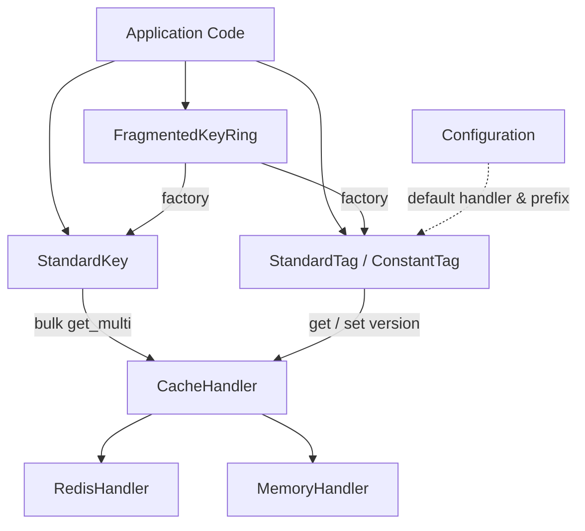
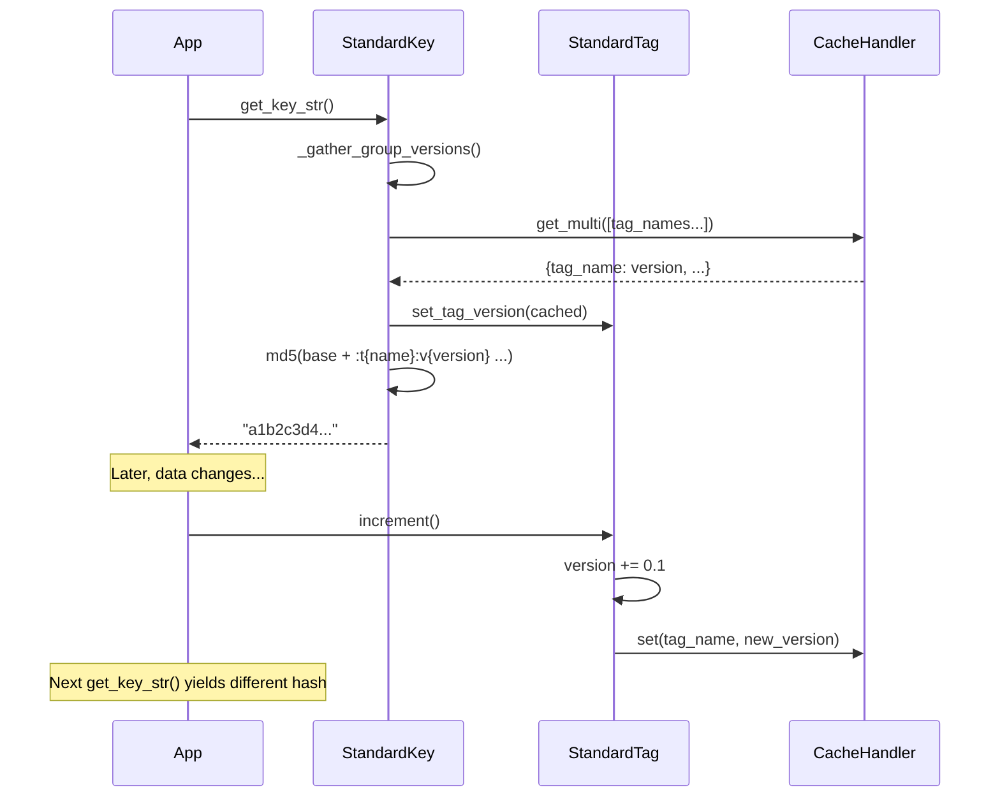

# Project Architecture

## Overview

**fragmented-keys** is a cache invalidation library that composes cache keys from independently versioned **tag-instance** pairs. Instead of deleting stale cache entries, you increment a tag's version — every composite key that includes that tag resolves to a new hash, producing a cache miss. Old entries expire naturally via TTL.

This is a Python port of [noizu-labs/fragmented-keys](https://github.com/noizu-labs/fragmented-keys) (PHP), adapted to use Redis as the primary cache backend.

## Component Diagram



## Core Components

| Component | Module | Purpose |
|-----------|--------|---------|
| **Configuration** | `configuration.py` | Global defaults: default cache handler and key prefix |
| **CacheHandler** | `protocols.py` | Protocol for cache backends (`get`, `set`, `get_multi`) |
| **BaseTag** | `tag/base.py` | Version storage/retrieval against a cache backend |
| **StandardTag** | `tag/standard.py` | Incrementable version (+0.1); persisted to cache |
| **ConstantTag** | `tag/constant.py` | Fixed version; all mutations are no-ops |
| **StandardKey** | `key/standard.py` | Composes tags into an MD5-hashed cache key |
| **FragmentedKeyRing** | `key_ring.py` | Template factory for defining and instantiating keys |
| **RedisHandler** | `cache_handler/redis_handler.py` | Redis backend via `redis-py` |
| **MemoryHandler** | `cache_handler/memory.py` | In-memory dict backend for testing |

## Data Flow



### Key Generation

1. Tags are grouped by their cache handler's `group_name()`
2. Tags where `delegate_cache_query()` returns `False` (e.g., `ConstantTag`) are skipped from bulk fetch
3. Each handler group is queried once via `get_multi()` for efficiency
4. Raw key: `"{key}_{groupId}:t{tag1}:v{ver1}:t{tag2}:v{ver2}..."`
5. Final key: MD5 hex digest of the raw string

### Version Lifecycle

- **Seed**: First access generates `time.time() * 1000` (milliseconds), stored in cache
- **Read**: Subsequent reads return the cached version
- **Increment**: `version += 0.1`, persisted immediately
- **Reset**: Replaced with a fresh millisecond timestamp

## Option Resolution

`FragmentedKeyRing` merges options in priority order:

```
global_options → global_tag_options[tag_name] → per-key overrides
```

Options control: `type` (standard/constant), `version`, `cache_handler`, `prefix`.

## Key Design Decisions

- **Redis over Memcache**: Modern default; `mget` for bulk fetches, `setex` for TTL
- **Protocols over ABCs**: Runtime-checkable protocols allow duck typing for custom handlers
- **Orphan invalidation**: Old keys are never deleted — they expire via TTL, avoiding cache stampede from bulk deletes
- **MD5 hashing**: Produces fixed-length keys safe for any cache backend; collision risk is acceptable since keys are ephemeral

## Technology Stack

| Layer | Choice |
|-------|--------|
| Language | Python 3.13+ |
| Cache backend | Redis (`redis-py >= 5.0`) |
| Build system | uv (`uv_build`) |
| Testing | pytest |
| Typing | PEP 561 (`py.typed`), runtime-checkable Protocols |
