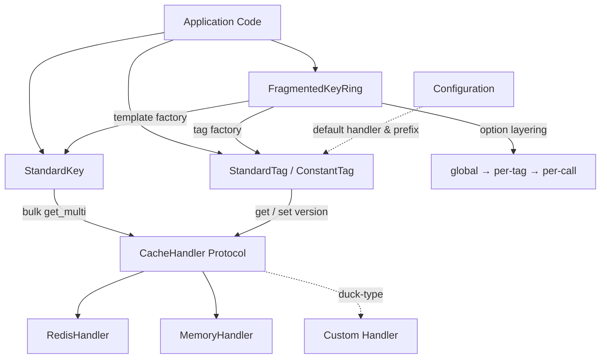

# Project Architecture

## Overview

**fragmented-keys** is a cache invalidation library that composes cache keys from independently versioned **tag-instance** pairs. Instead of deleting stale cache entries, you increment a tag's version — every composite key that includes that tag resolves to a new hash, producing a cache miss. Old entries expire naturally via TTL.

This is a Python port of [noizu-labs/fragmented-keys](https://github.com/noizu-labs/fragmented-keys) (PHP), adapted to use Redis as the primary cache backend. Published as `fragmented-keys` on PyPI.

## System Diagram

```mermaid
graph TD
    App[Application Code] --> KR[FragmentedKeyRing]
    App --> SK[StandardKey]
    App --> ST[StandardTag / ConstantTag]
    KR -->|template factory| SK
    KR -->|tag factory| ST
    KR -->|option layering| OPT[global → per-tag → per-call]
    SK -->|bulk get_multi| CH[CacheHandler Protocol]
    ST -->|get / set version| CH
    CH --> Redis[RedisHandler]
    CH --> Mem[MemoryHandler]
    CH -.->|duck-type| Custom[Custom Handler]
    Config[Configuration] -.->|default handler & prefix| ST
```

## Core Components

| Component | Module | Purpose |
|-----------|--------|---------|
| **Configuration** | `configuration.py` | Class-level singleton for global defaults: cache handler and key prefix |
| **CacheHandler** | `protocols.py` | `@runtime_checkable` Protocol for cache backends (4 methods) |
| **Tag / Key / KeyRing** | `protocols.py` | `@runtime_checkable` Protocols defining the full type contract |
| **BaseTag** | `tag/base.py` | Version storage/retrieval, lazy seeding, cache delegation logic |
| **StandardTag** | `tag/standard.py` | Incrementable version (+0.1 per call); persisted to cache |
| **ConstantTag** | `tag/constant.py` | Fixed version; all mutations are no-ops; excluded from bulk fetches |
| **StandardKey** | `key/standard.py` | Composes tags into an MD5-hashed cache key with bulk version fetching |
| **FragmentedKeyRing** | `key_ring.py` | Template factory: define keys, layer options, dynamic accessors |
| **RedisHandler** | `cache_handler/redis_handler.py` | Redis backend via injected `redis.Redis` client |
| **MemoryHandler** | `cache_handler/memory.py` | In-memory dict backend for testing (no TTL support) |

→ *See [arch/protocols-api.md](arch/protocols-api.md) for full protocol signatures, public API surface, and error catalog*

## Data Flow

Requests flow through three stages: tag grouping, bulk version fetch, and hash composition.

1. Tags are grouped by their cache handler's `group_name()`
2. `ConstantTag` instances are excluded from bulk fetch (`delegate_cache_query() → False`)
3. Each handler group is queried once via `get_multi()` — N tags across M handlers = M cache calls
4. Raw key: `"{key}_{groupId}:t{tag1}:v{ver1}:t{tag2}:v{ver2}..."`
5. Final key: `md5(raw.encode("utf-8")).hexdigest()` — 32-character hex string

→ *See [arch/data-flow.md](arch/data-flow.md) for sequence diagrams, version lifecycle state machine, and option resolution flow*

## FragmentedKeyRing

The primary user-facing API. Defines reusable key templates, manages handler registration, and layers options across three tiers (global → per-tag → per-call). Supports dynamic method access via `ring.get_{key_name}_key_obj(*args)`.

→ *See [arch/key-ring.md](arch/key-ring.md) for constructor reference, option layering, and dynamic accessor resolution*

## Cache Handlers

Protocol-based — any object implementing `group_name`, `get`, `set`, `get_multi` works. Two built-in implementations: `RedisHandler` (production, injected client, bytes decoding) and `MemoryHandler` (testing, no TTL).

→ *See [arch/cache-handlers.md](arch/cache-handlers.md) for implementation details and custom handler guide*

## Version Management

- **Seed**: First access generates `time.time() * 1000` (millisecond timestamp), stored in cache
- **Read**: Subsequent reads return cached version; lazy-loaded on first `get_tag_version()` call
- **Increment**: `version += 0.1`, persisted immediately — fractional part counts invalidations
- **Reset**: Replaced with a fresh millisecond timestamp
- **ConstantTag**: Version is constructor-fixed (`default=1.0`), never touches cache

## Key Design Decisions

| Decision | Rationale |
|----------|-----------|
| **Redis over Memcache** | Modern default; `MGET` for bulk fetches, `SETEX` for TTL |
| **Protocols over ABCs** | `@runtime_checkable` protocols allow duck typing; no inheritance tax for custom handlers |
| **Orphan invalidation** | Old keys expire via TTL — no cache stampede from bulk deletes |
| **MD5 hashing** | Fixed-length keys safe for any cache backend; collision risk acceptable for ephemeral cache keys |
| **Injected Redis client** | `RedisHandler` takes `redis.Redis` in constructor; `TYPE_CHECKING` import keeps module-load clean |
| **Class-level Configuration** | All `@classmethod` — no instantiation needed; `reset()` for test isolation |
| **Millisecond seed** | `time.time() * 1000` ensures unique initial versions without coordination |
| **Sync-only** | All interfaces are synchronous; `pytest-asyncio` is a dev dependency but currently unused |

## Technology Stack

| Layer | Choice |
|-------|--------|
| Language | Python 3.13+ |
| Cache backend | Redis (`redis-py >= 5.0`) |
| Build system | `uv_build` (`>= 0.10.0, < 0.11.0`) |
| Testing | pytest, pytest-asyncio |
| Documentation | Sphinx + Furo theme, hosted on Read the Docs |
| Typing | PEP 561 (`py.typed`), `@runtime_checkable` Protocols |
| License | MIT |

## Testing Architecture

26+ tests across 4 test classes using `pytest`:

| Test Class | Coverage |
|------------|----------|
| `TestStandardTag` | Version stability, increment, instance isolation, tag name isolation |
| `TestConstantTag` | Fixed version, increment/reset/set no-ops |
| `TestStandardKey` | Key stability, invalidation on increment, multi-tag, mixed handlers, bulk-fetch delegation |
| `TestKeyRing` | define+get, dynamic accessor, equivalence with manual, constant tags, handler override, `list_defined_keys` |

Test isolation via `conftest.py`: auto-use fixture resets `Configuration` before/after every test; `memory_handler` fixture provides a clean `MemoryHandler` with `"Test"` prefix.
