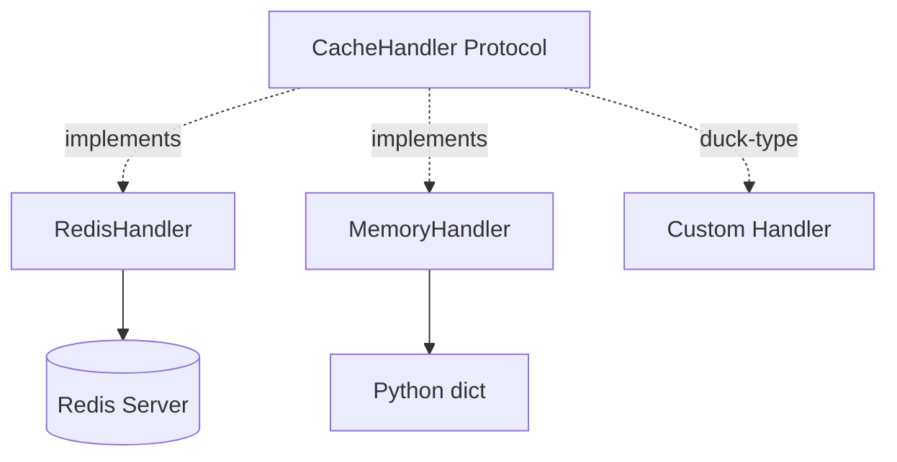

# Cache Handlers

## Handler Architecture



Cache handlers are protocol-based — any object satisfying the 4-method `CacheHandler` protocol works. No inheritance required.

## RedisHandler

**Constructor**: `RedisHandler(client: redis.Redis)` — the Redis client is injected, not created internally.

**Encoding**: All values are stored as strings. `get()` and `get_multi()` decode `bytes` responses from `redis-py` via `.decode("utf-8")`.

| Method | Redis Command | Notes |
|--------|---------------|-------|
| `get(key)` | `GET key` | Returns `None` on miss |
| `set(key, value, ttl=None)` | `SET` or `SETEX` | `SETEX` when TTL provided |
| `get_multi(keys)` | `MGET keys...` | Skips `None` values in result dict |
| `group_name()` | — | Returns `"RedisHandler"` |

**TYPE_CHECKING guard**: `redis.Redis` is imported only under `TYPE_CHECKING` — the actual client is passed in at runtime, keeping `redis` as a soft import at module-load time.

## MemoryHandler

**Purpose**: Testing and development. In-memory `dict[str, str]` backend.

| Method | Behavior |
|--------|----------|
| `get(key)` | Dict lookup, `None` on miss |
| `set(key, value, ttl=None)` | Dict assignment; **TTL is silently ignored** |
| `get_multi(keys)` | Dict comprehension, skips missing keys |
| `group_name()` | Returns `"MemoryHandler"` |
| `clear()` | Resets dict; **not part of CacheHandler protocol** |

**Limitation**: No TTL support — entries never expire. Suitable for unit tests but not for validating expiry behavior.

## Writing a Custom Handler

Implement the four protocol methods:

```python
class MyHandler:
    def group_name(self) -> str:
        return "MyHandler"

    def get(self, key: str) -> str | None:
        ...

    def set(self, key: str, value: str, ttl: int | None = None) -> None:
        ...

    def get_multi(self, keys: list[str]) -> dict[str, str]:
        ...
```

Register with `FragmentedKeyRing`:

```python
ring = FragmentedKeyRing(
    cache_handlers={"my": MyHandler()},
    default_cache_handler="my",
)
```

Or set globally:

```python
Configuration.set_default_cache_handler(MyHandler())
```
