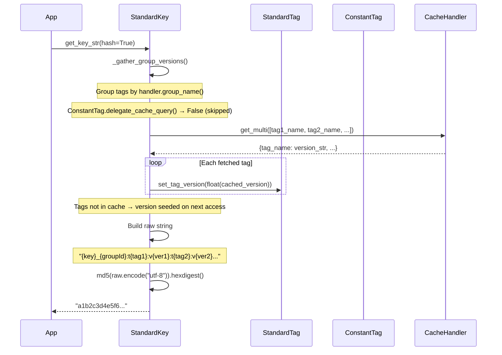
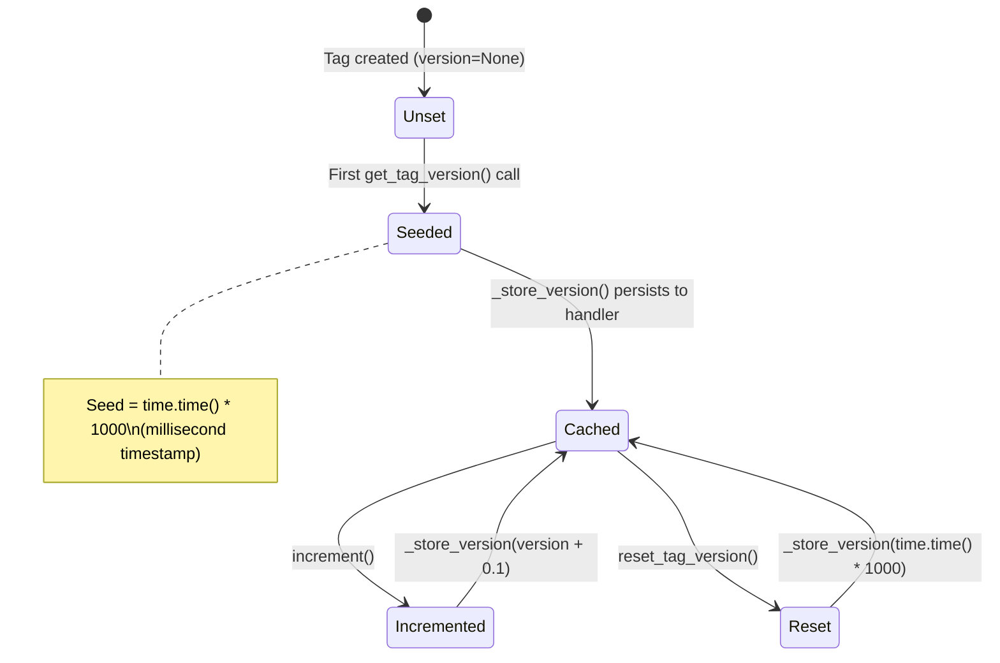
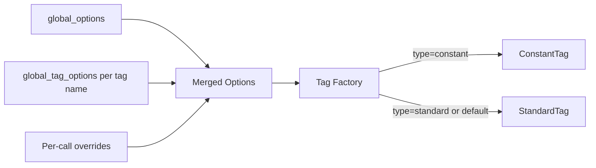

# Data Flow

## Key Generation — Detailed Sequence

## Version Lifecycle

### Version Seeding

On first access, if no version exists in cache, `BaseTag._get_version()` generates `time.time() * 1000` (millisecond-precision Unix timestamp) and stores it. This ensures unique initial versions across tags without coordination.

### Version Increment

`StandardTag.increment()` adds `0.1` to the current version and persists immediately. The fractional increment means:
- Integer part: original seed timestamp
- Fractional part: number of invalidations (× 0.1)

### Bulk Fetch Optimization

`StandardKey._gather_group_versions()` reduces cache round-trips:

1. Partition tags into groups by `handler.group_name()`
2. Exclude tags where `delegate_cache_query(group) == False` (i.e., `ConstantTag`)
3. Issue one `get_multi()` per handler group
4. Distribute fetched versions back to individual tags via `set_tag_version()`

For N tags across M handler types, this produces M cache calls instead of N.

## Option Resolution — FragmentedKeyRing

Merge priority (highest wins): per-call overrides > per-tag globals > global options.

Recognized option keys:
- `type` — `"standard"` (default) or `"constant"`
- `version` — explicit initial version (float)
- `cache_handler` — handler name string (resolved via `_resolve_handler`)
- `prefix` — key prefix string
