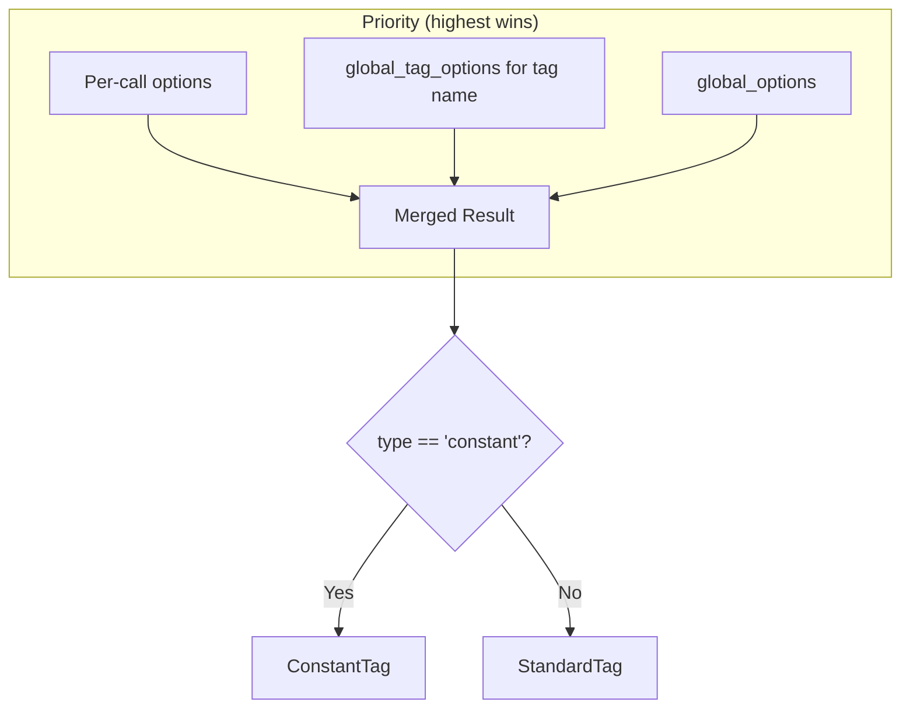

# FragmentedKeyRing — Template Factory

## Overview

`FragmentedKeyRing` is the primary user-facing API for defining reusable cache key templates and instantiating them with runtime values. It manages handler resolution, option layering, and provides dynamic method access.

## Constructor

```python
FragmentedKeyRing(
    global_options: dict[str, Any] | None = None,
    global_tag_options: dict[str, dict[str, Any]] | None = None,
    default_cache_handler: str = "memory",
    cache_handlers: dict[str, Any] | None = None,   # default: {"memory": MemoryHandler()}
    default_prefix: str = "DefaultPrefix",
)
```

## Key Definition

```python
ring.define_key(
    key="user_profile",
    params=["User", "Profile"],           # tag names (strings)
    globals={"cache_handler": "redis"},    # optional per-key handler override
)

# Or with per-tag overrides:
ring.define_key(
    key="user_profile",
    params=[
        "User",
        {"tag": "Profile", "type": "constant", "version": 1.0},
    ],
)
```

## Key Instantiation

Two equivalent access patterns:

```python
# Explicit
key_obj = ring.get_key_obj("user_profile", ["42", "settings"])

# Dynamic accessor
key_obj = ring.get_user_profile_key_obj("42", "settings")
```

### Dynamic Accessor Resolution

`__getattr__` intercepts calls matching `get_{name}_key_obj`:

1. Strip `get_` prefix and `_key_obj` suffix
2. Lowercase and strip underscores from both the attr name and defined key names
3. Match against registered key definitions
4. Return a factory function `(*args) -> StandardKey`

## Introspection

```python
ring.list_defined_keys()  # returns deep copy of internal _key_definitions dict
```

Returns the full definition dict keyed by key name. The copy prevents external mutation of internal state.

## Option Layering



### Managed Options

| Key | Type | Effect |
|-----|------|--------|
| `type` | `str` | `"standard"` (default) or `"constant"` — selects tag class |
| `version` | `float` | Explicit initial version (bypasses cache seed) |
| `cache_handler` | `str` | Handler name resolved via `_resolve_handler()` |
| `prefix` | `str` | Tag name prefix (default: ring's `default_prefix`) |

## Handler Registry

Handlers are registered by name in the constructor's `cache_handlers` dict. The `default_cache_handler` string selects which name is used when no override is specified.

```python
ring = FragmentedKeyRing(
    cache_handlers={
        "memory": MemoryHandler(),
        "redis": RedisHandler(redis_client),
    },
    default_cache_handler="redis",
)
```

`_resolve_handler(name)` raises `ValueError` for unregistered names.
